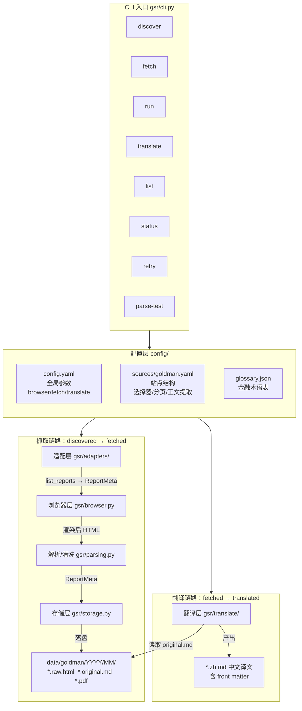

# gsr 架构图

投行研报抓取与中译工具的整体架构。



## 模块职责

### 配置层 `config/`

| 文件 | 职责 |
|---|---|
| `config.yaml` | 全局参数：浏览器内核/限速/超时、fetch 重试、翻译 provider/分块/并发 |
| `sources/goldman.yaml` | 高盛站点的 URL 模式、解析策略、翻页、正文提取、免责声明截断规则 |
| `glossary.json` | 金融术语表，翻译时只注入当前分块实际出现的词条 |

### 抓取链路（discovered → fetched）

| 模块 | 职责 |
|---|---|
| `gsr/adapters/base.py` | 抽象基类 + 注册表，新增源只需继承实现两个方法 |
| `gsr/adapters/goldman.py` | 高盛实现；三级降级解析：`embedded_json → search_table → dom_testid → href_regex` |
| `gsr/browser.py` | Playwright persistent context，`cf_clearance` 持久化复用；限速防验证码；挑战检测；`page.request` 下载 PDF |
| `gsr/parsing.py` | 内嵌 JSON 挖掘、HTML→Markdown、阅读器 UI 残渣清洗、免责声明截断 |
| `gsr/storage.py` | SQLite 去重（`source:uuid`）、状态机、失败信息与 status 解耦 |

### 翻译链路（fetched → translated）

| 模块 | 职责 |
|---|---|
| `gsr/translate/translator.py` | 编排：front matter 原样保留 → 分块 → 并发调用 → 拼回纯中文 Markdown |
| `gsr/translate/chunker.py` | 结构感知分块（标题 > 段落 > 句末标点），绝不切句子中间 |
| `gsr/translate/cache.py` | 分块级缓存 `<输出>.parts.json`，断点续译省 token |
| `gsr/translate/providers.py` | provider 适配：OpenAI 兼容（DeepSeek/通义/智谱/魔搭/OpenAI）+ Anthropic，统一 httpx |

## 核心设计要点

1. **单条流水线、两阶段**：`discovered → fetched → translated` 由 SQLite 状态机驱动；抓取走 Playwright 浏览器，翻译独立从库中取 `status='fetched'` 的队列。
2. **必须浏览器**：高盛站点挂 Cloudflare challenge，纯 HTTP 一律 403；抓取层建立在 persistent context 上，`cf_clearance` 持久化复用。
3. **适配层可扩展**：新增研报源 = 加 `config/sources/<name>.yaml` + 一个继承 `BaseAdapter` 的类，主流程零改动。
4. **失败与进度解耦**：`status` 单调前进，失败记在 `fail_count`/`failed_stage`/`last_error`，重试自然落回正确队列。
5. **翻译层的省钱设计**：分块级缓存（`.parts.json`）+ 术语表按块注入 + 瞬时故障/配置问题区分重试。
6. **日期来源固定**：一律取自 URL 路径（`/reports/YYYY/MM/DD/`），不使用受时区影响的展示文本。

## 数据流

```
python -m gsr run --since ytd
  │
  ├─ list_reports()      adapter 翻 search.html?page=N（日期早停）
  │                       三级降级解析出 ReportMeta
  │
  ├─ upsert_discovered() SQLite 去重入库（status=discovered）
  │
  ├─ fetch_report()      逐篇抓详情页 HTML + 下载 PDF
  │                       清洗成 .original.md 落盘
  │                       mark_fetched()
  │
  └─ translate           取 status=fetched 队列
                          分块 → provider → 缓存 → .zh.md
                          mark_translated()
```
